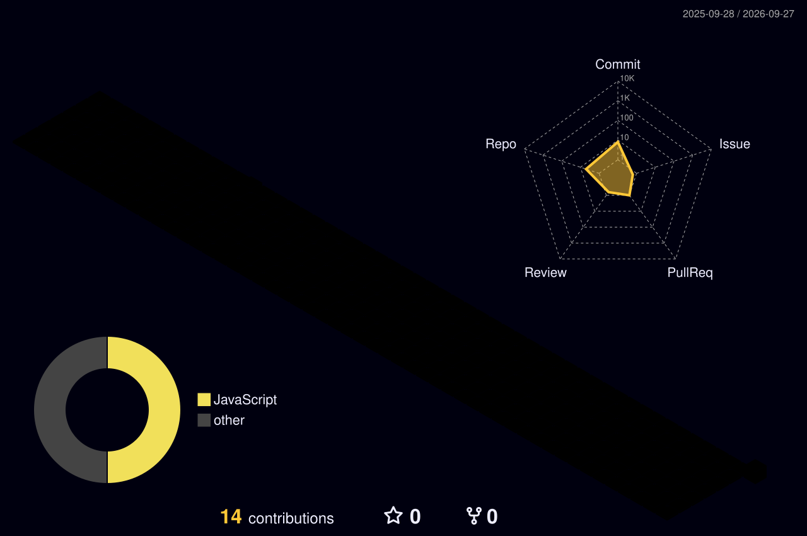

  

  

 

<!-- Social Links -->

  
  
  
  

 

<!-- About Section -->
<table align="center" style="border: none; background: transparent;">
  <tr>
    <td width="60%">
      <h2>👨‍💻 Architecting Digital Realities</h2>
      
I specialize in bridging the gap between innovative design and robust engineering.

      <ul>
        <li>🚀 <b>Building:</b> <a href="https://siraawata.lk">Siraawata.lk</a> & AI-driven Smart Bins</li>
        <li>💼 <b>Role:</b> Founder @ <b>N-CODE STUDIO</b></li>
        <li>🎓 <b>Education:</b> BEng in Computer Software Eng. (2025-2029)</li>
        <li>💡 <b>Stack:</b> MERN, Laravel 11, UI/UX, SEO & PWA</li>
        <li>📫 <b>Reach out:</b> <a href="mailto:deshannethmina2@gmail.com">deshannethmina2@gmail.com</a></li>
      </ul>
    </td>
    <td width="40%" align="center">
      
    </td>
  </tr>
</table>

 

<h2 align="center">⚙️ Core Technologies</h2>

  

 

<!-- 1. Profile Summary Cards Section -->
<h2 align="center">📊 Profile Summary & Commits</h2>
<table align="center" style="border: none; background: transparent;">
  <tr>
    <td align="center"></td>
    <td align="center"></td>
  </tr>
  <tr>
    <td align="center"></td>
    <td align="center"></td>
  </tr>
  <tr>
    <td colspan="2" align="center"></td>
  </tr>
</table>

 

<!-- 2. 3D Contribution Graph Section (From your Image) -->
<h2 align="center">🧊 3D Contribution Graph</h2>

  

 

<!-- Basic Stats & Streak -->
<h2 align="center">📈 Overall Analytics</h2>
<table align="center" style="border: none; background: transparent;">
  <tr>
    <td align="center">
      
    </td>
    <td align="center">
      
    </td>
  </tr>
  <tr>
    <td colspan="2" align="center">
      
    </td>
  </tr>
</table>

  

  

